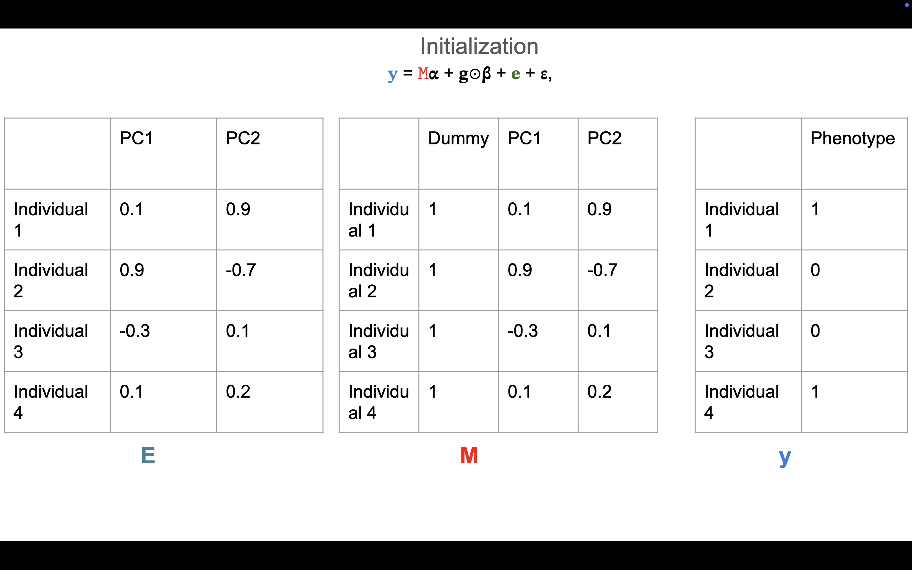
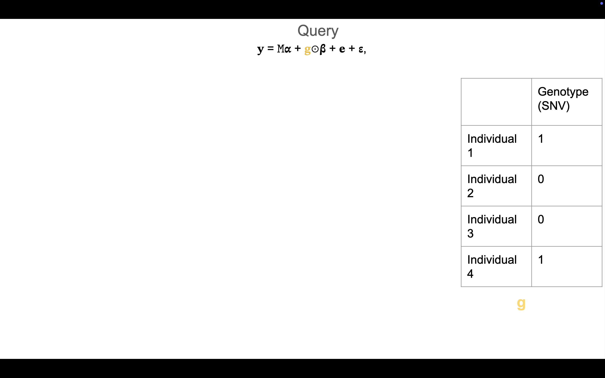

# Cis_and_trans_effects_of_haplotypes_on_variant_penetrance

Hackathon team: Maria Chikina (Lead), Louison (analyst), Li Chuin Chong (SysAdmin), Halimat Chisom Atanda (Writer)

Haplotypes are distinct combinations of alleles or genetic variants that are often co-inherited due to a mechanism like linkage disequilibrium. These haplotypes can influence the expression and penetrance of individual variants, yet the mechanisms underlying these effects remain poorly understood. In this project, we explore the cis and trans effects of haplotypes on the penetrance of rare variants by modelling interactions between a single nucleotide polymorphism (SNP) and genetic relationship-informed variables.

## Initial proposed workflow

## Current flowchart

## Method

The pipeline will require the following inputs: a vcf file, a query variant, a query region...

